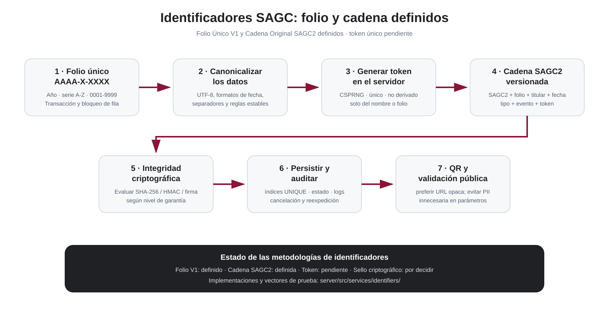

<div align="center">
  

  # SAGC

  ## Sistema Automatizado de Gestión de Constancias

  **Documento maestro inicial de alcance funcional, visual y técnico**

  <br />

  <a href="https://github.com/gio-canto/Sistema-automatizado-de-gesti-n-de-constancias-SAGC-">
    
  </a>
  <a href="https://gio-canto.github.io/Sistema-automatizado-de-gesti-n-de-constancias-SAGC-/">
    
  </a>
  <a href="https://github.com/gio-canto/Sistema-automatizado-de-gesti-n-de-constancias-SAGC-/actions">
    
  </a>

  <br /><br />

  
  
  
  
  
</div>

---

> [!IMPORTANT]
> Este README no representa todavía una especificación contractual final. Resume lo observado en la propuesta visual, el ejemplo real de constancia entregado como referencia y las decisiones técnicas iniciales del equipo. Todo requisito deberá validarse con el Consejo antes de considerarse definitivo.

> [!WARNING]
> **Mantener el repositorio privado durante el desarrollo interno.** Si el repositorio aparece público, revisar la visibilidad antes de incorporar backend, esquemas definitivos, documentación interna, secretos o datos de prueba sensibles.

---

# 1. Qué se va a construir realmente

SAGC no será solamente un generador de PDF.

El sistema deberá cubrir el ciclo completo de una emisión documental:

1. acceso de personal autorizado;
2. configuración del documento y del evento;
3. definición de textos y campos variables;
4. selección o carga de plantilla;
5. captura manual o carga masiva de personas;
6. revisión de la información;
7. creación automática de folio, cadena, token único y QR;
8. composición del documento;
9. previsualización;
10. descarga;
11. persistencia del registro emitido;
12. validación pública posterior.

El proyecto se divide en dos productos conectados:

<p align="center">
  
</p>

### A. Sistema de gestión

Uso exclusivo de personal autorizado.

Responsable de:

- usuarios;
- eventos;
- tipos de documento;
- textos;
- campos especiales;
- plantillas;
- participantes;
- emisión;
- folios;
- cadena;
- token;
- QR;
- PDF;
- descargas;
- auditoría.

### B. Validador público

Acceso público para comprobar documentos emitidos.

Debe permitir:

- validación directa mediante QR;
- consulta manual;
- mostrar documento válido;
- mostrar documento cancelado, cuando aplique;
- mostrar documento no encontrado o no válido.

---

# 2. Lectura visual de la propuesta

El análisis de las pantallas conceptuales permite identificar un flujo mucho más preciso que el descrito inicialmente solo en texto.

<p align="center">
  
</p>

## Flujo funcional esperado

```text
LOGIN
  ↓
TIPO DE DOCUMENTO
  ↓
DATOS DEL EVENTO
  ↓
TEXTOS
  ↓
CAMPOS ESPECIALES
  ↓
TAMAÑO Y ORIENTACIÓN
  ↓
PLANTILLA
  ↓
PREVISUALIZACIÓN
  ↓
CAPTURA MANUAL / CARGA MASIVA
  ↓
REVISIÓN Y CORRECCIÓN
  ↓
GENERACIÓN DE IDENTIFICADORES
  ↓
GENERACIÓN DE DOCUMENTOS
  ↓
PREVISUALIZACIÓN FINAL
  ↓
DESCARGA
  ↓
REGISTRO PERSISTENTE
  ↓
VALIDADOR PÚBLICO
```

---

# 3. Tipos de documento

La propuesta visual contempla como mínimo:

- Constancia
- Diploma
- Reconocimiento
- Acreditación
- Otros / Personalizado

La arquitectura no debe codificar estos tipos como pantallas separadas e irrepetibles.

Se recomienda tratarlos como un catálogo configurable:

```text
tipo_documento
├── id
├── nombre
├── activo
├── plantilla_default
├── reglas
└── campos_base
```

La opción **Otros / Personalizado** deberá permitir crear una emisión que no dependa de uno de los tipos preconfigurados.

---

# 4. Eventos, textos y campos especiales

La propuesta visual muestra una pantalla donde el operador puede definir:

- nombre del evento;
- ID del evento;
- institución emisora;
- encabezados;
- tipo de reconocimiento;
- texto principal;
- lugar;
- fecha;
- autoridad;
- colores por sección;
- campos especiales;
- contenido con Markdown.

## Campos especiales

El concepto de campos especiales es central porque permite que una misma plantilla funcione con distintos datos.

Ejemplos:

```text
{nombre}
{proyecto}
{area}
{modalidad}
{folio}
{fecha}
{evento}
{token}
```

El sistema deberá permitir definir nuevos campos antes de la captura de participantes.

### Regla importante

Los campos especiales creados para una emisión deben propagarse automáticamente a:

- captura manual;
- formato de carga masiva;
- validación de datos;
- composición de la constancia.

---

# 5. Plantillas y diseño

La propuesta visual muestra:

- plantillas básicas;
- plantillas personalizadas;
- descarga de guía;
- carga de archivo;
- previsualización;
- aceptación o rechazo;
- opción de guardar diseño.

## Decisión funcional para SAGC

Las plantillas podrán tener dos comportamientos:

### Plantilla temporal

Se usa únicamente para una emisión y puede eliminarse después de terminar el proceso, de acuerdo con la política que defina el Consejo.

### Plantilla reutilizable

Se guarda en SAGC y queda disponible en futuras emisiones.

Debe contener al menos:

```text
id_plantilla
nombre
tipo_documento
version
orientacion
tamano
archivo
miniatura
activo
creado_por
fecha_creacion
```

> [!IMPORTANT]
> La versión final debe resolver la contradicción del prototipo visual entre “no almacenar” el archivo personalizado y “guardar diseño”. La propuesta técnica actual es permitir ambos modos: temporal o reutilizable.

## Formatos candidatos

- PDF
- PNG
- JPG/JPEG
- TIFF

El backend deberá validar:

- dimensiones;
- orientación;
- peso;
- MIME real;
- resolución;
- áreas de seguridad.

---

# 6. Captura manual y carga masiva

La propuesta visual separa claramente ambos métodos.

## Manual

Pensado para:

- una persona;
- grupos pequeños;
- correcciones;
- altas adicionales.

Debe permitir:

- agregar;
- editar;
- eliminar antes de emitir;
- validar campos obligatorios.

## Masiva

Pensada para eventos con gran cantidad de personas.

Formato principal propuesto:

```text
.xlsx
```

Otros formatos solo deberán habilitarse si existe una necesidad real.

### La carga no genera inmediatamente los documentos

Primero debe existir una pantalla de revisión.

SAGC deberá detectar:

- campos vacíos;
- datos inválidos;
- duplicados;
- columnas desconocidas;
- campos especiales faltantes;
- folios repetidos, si existieran datos heredados;
- errores de tipo.

---

# 7. Folio, cadena, token único y QR

Esta parte debe considerarse **un subsistema propio**.

No se debe implementar con concatenaciones improvisadas dentro del frontend.

## Folio

Identificador legible por personas.

Ejemplo conceptual:

```text
FGRO/25/1380
```

La metodología definitiva deberá definir:

- prefijo;
- año;
- consecutivo;
- reinicio anual o global;
- tratamiento de cancelaciones;
- reservas;
- concurrencia;
- reexpediciones.

La asignación debe hacerse en el backend mediante una operación atómica.

## Token único

El ejemplo visual incorpora un token individual por constancia.

### Decisión propuesta

El token:

- debe generarse en el servidor;
- debe ser único;
- debe ser impredecible;
- no debe ser ingresado manualmente;
- no debe derivarse solamente del nombre o del folio;
- no debe poder editarse desde la pantalla del operador.

Se recomienda evaluar un identificador generado mediante CSPRNG con suficiente entropía y codificación segura para URL.

## Cadena de validación

El ejemplo de constancia también incluye una cadena con datos de la emisión.

La cadena que aparece en los prototipos debe tratarse únicamente como **ejemplo**, no como algoritmo definitivo.

---

# 8. Metodología obligatoria para cadena y token

Antes de implementar producción se deberá crear un documento técnico específico:

## “Metodología de generación y validación de identificadores SAGC”

<p align="center">
  
</p>

La metodología deberá definir como mínimo:

### 8.1 Objetivo

Determinar qué función cumple cada elemento:

| Elemento | Función |
|---|---|
| Folio | Identificación humana |
| Token único | Identificador opaco de la emisión |
| Cadena | Representación verificable de datos de emisión |
| QR | Acceso al validador |
| Hash / firma | Integridad, cuando aplique |

### 8.2 Datos inmutables

Definir cuáles campos intervienen.

Ejemplo candidato:

```text
version
id_constancia
folio
id_evento
tipo_documento
nombre_normalizado
fecha_emision
modalidad
id_autoridad
token
```

### 8.3 Canonicalización

Debe existir una regla exacta para evitar que dos implementaciones generen resultados diferentes.

Definir:

- UTF-8;
- mayúsculas/minúsculas;
- espacios;
- acentos;
- fechas;
- valores nulos;
- separadores;
- caracteres escapados;
- orden de campos.

### 8.4 Versionado

La metodología debe incluir una versión.

Ejemplo:

```text
SAGC-ID-V1
```

Esto permitirá cambiar el método en el futuro sin invalidar documentos anteriores.

### 8.5 Generación del token

La especificación deberá fijar:

- algoritmo;
- longitud;
- entropía mínima;
- codificación;
- restricciones;
- índice UNIQUE;
- política ante colisión.

### 8.6 Construcción de la cadena

La cadena puede representarse mediante una serialización canónica.

No se debe asumir que:

```text
campo1|campo2|campo3
```

sea suficiente sin definir escape, orden y versión.

### 8.7 Integridad criptográfica

Deberá evaluarse qué nivel requiere el Consejo:

- SHA-256 como huella;
- HMAC-SHA-256 si se necesita autenticidad basada en secreto del servidor;
- firma digital si se requiere una garantía criptográfica más fuerte.

La decisión no debe improvisarse durante la programación.

### 8.8 QR

Recomendación inicial:

```text
https://dominio/sagc/validacion/<token>
```

o una ruta equivalente con identificador opaco.

Esto evita colocar innecesariamente nombre completo y otros datos personales en la URL.

La consulta manual por nombre + folio puede mantenerse como método secundario.

### 8.9 Cancelación y reexpedición

Debe definirse:

- si un token cancelado permanece consultable;
- qué muestra el validador;
- si una reexpedición obtiene nuevo token;
- relación entre documento original y reemplazo.

### 8.10 Entregables de la metodología

Antes de cerrar este módulo deberán existir:

- especificación escrita;
- pseudocódigo;
- ejemplos de entrada/salida;
- casos de prueba;
- reglas de unicidad;
- política de versionado;
- modelo de amenazas;
- esquema de base de datos;
- restricciones SQL;
- pruebas de colisión;
- pruebas de validación.

---

# 9. Qué debe producir una constancia SAGC

El segundo PDF de referencia permite definir con mayor precisión el resultado esperado.

La constancia final no es solo una imagen con un nombre.

Debe poder contener:

- identidad institucional;
- tipo de documento;
- nombre;
- motivo;
- proyecto;
- área;
- modalidad;
- evento;
- autoridad;
- QR;
- cadena;
- token;
- folio;
- fecha;
- lugar.

<p align="center">
  
</p>

> [!NOTE]
> La ilustración anterior no pretende reemplazar la plantilla oficial. Su función es documentar qué información tiene que ser capaz de producir el motor de composición.

## Mejora sobre el prototipo visual

En las pantallas conceptuales aparece un campo **Token Único** dentro de la edición individual.

En la implementación final:

```text
folio        → generado por SAGC
token_unico  → generado por SAGC
cadena       → generada por SAGC
qr           → generado por SAGC
```

No deberán ser campos de entrada ordinaria.

---

# 10. Generación del documento

El motor deberá separar:

```text
PLANTILLA
+
DATOS DEL EVENTO
+
DATOS DEL PARTICIPANTE
+
IDENTIFICADORES
+
QR
=
DOCUMENTO FINAL
```

Se recomienda que la generación ocurra en backend o en un servicio controlado.

Debe producir al menos:

- PDF final;
- vista previa;
- miniatura opcional;
- registro de emisión;
- hash del archivo, si se adopta;
- asociación con la constancia en base de datos.

---

# 11. Descarga y cierre

El prototipo contempla:

- descarga individual;
- descarga de todos;
- confirmación antes de terminar.

## Decisión propuesta

Descarga múltiple:

```text
ZIP
```

RAR no se considera necesario salvo requerimiento explícito.

### Terminar no debe borrar la trazabilidad

Cuando el usuario finaliza:

- los PDF temporales pueden limpiarse según política;
- los registros emitidos no deben desaparecer;
- folio, token, cadena, estado y auditoría deben persistir;
- las plantillas reutilizables deben permanecer.

---

# 12. Validador público

## Método principal: QR

El QR abre directamente el registro correspondiente.

## Método alterno

Formulario con:

- nombre;
- folio;
- CAPTCHA cuando sea necesario.

## Documento válido

Puede mostrar:

- tipo;
- titular;
- evento;
- proyecto;
- área;
- modalidad;
- folio;
- autoridad;
- fecha;
- estado.

La exposición pública completa de cadena y token deberá definirse con el Consejo.

## Documento no válido

Debe mostrar un mensaje inequívoco sin revelar información de terceros.

---

# 13. Administración de usuarios

La propuesta contempla dos roles iniciales:

| Rol | Uso |
|---|---|
| NORMAL | Operación ordinaria |
| ADMIN | Administración de usuarios y funciones reservadas |

ADMIN deberá poder:

- crear usuario;
- editar usuario;
- cambiar o restablecer contraseña;
- activar/desactivar;
- asignar rol;
- administrar fotografía;
- consultar auditoría;
- eliminar, si la política lo permite.

> [!CAUTION]
> La imagen conceptual de una “consola” o almacenamiento del navegador no debe trasladarse a producción. La administración real debe operar contra el backend y la base de datos con autorización server-side.

---

# 14. Backend y base de datos

El documento visual propone inicialmente:

```text
usuarios
eventos
plantillas
constancias
contador_folios
```

Para un sistema real se recomienda incorporar además auditoría y versionado donde corresponda.

<p align="center">
  
</p>

## usuarios

```text
id_usuario
nombre
usuario
password_hash
permiso
foto
activo
fecha_creacion
```

Hash recomendado a evaluar:

```text
Argon2id
```

## eventos

```text
id_evento
nombre
fecha_inicio
fecha_fin
lugar
responsable
estado
fecha_creacion
```

## plantillas

```text
id_plantilla
nombre
tipo_documento
version
orientacion
tamano
archivo
miniatura
activo
creado_por
fecha_creacion
```

## constancias

```text
id_constancia
id_evento
id_plantilla
tipo_documento
nombre_persona
datos_variables
folio
token_unico
cadena_validacion
qr_destino
fecha_emision
emitido_por
estado
id_constancia_origen
```

## contador_folios

Debe garantizar concurrencia y evitar colisiones.

## auditoria

Propuesta adicional necesaria para producción:

```text
id_log
id_usuario
accion
entidad
id_entidad
fecha
ip
metadata
```

---

# 15. Seguridad mínima

Antes de utilizar datos reales:

- backend de autenticación;
- hash de contraseñas;
- sesiones seguras;
- HTTPS;
- control de roles server-side;
- rate limiting;
- validación de archivos;
- CAPTCHA validado en servidor;
- auditoría;
- protección CSRF cuando aplique;
- sanitización de Markdown;
- límites de carga;
- backups;
- política de datos personales.

Nunca subir:

```text
contraseñas reales
API keys
tokens de producción
claves privadas
credenciales de BD
.env con secretos
respaldos con datos personales
```

---

# 16. Estado actual del repositorio

## Actualmente implementado

- React;
- Vite;
- CSS;
- login visual;
- usuario de prueba local;
- carrusel de imágenes;
- logo institucional;
- CAPTCHA de interfaz;
- workflow de GitHub Pages;
- estructura inicial de API Node.js/Express;
- conexión MySQL mediante `mysql2/promise`;
- esquema MySQL v0.1;
- catálogos iniciales;
- usuario de aplicación MySQL documentado;
- script de comprobación de conexión;
- bootstrap de administrador con Argon2id;
- guía completa para MySQL Workbench.

## Aún por desarrollar

- endpoints funcionales completos del backend;
- integración del login React con la API;
- lógica de negocio sobre la base de datos;
- autenticación real;
- administración;
- eventos;
- tipos de documento;
- editor de textos;
- campos especiales;
- plantillas persistentes;
- importación XLSX;
- revisión de datos;
- contador de folios;
- metodología de cadena/token;
- generación de QR;
- motor PDF;
- ZIP;
- validador;
- auditoría.

---

# 17. Roadmap técnico

## Fase 0 — Frontend base

- [x] React + Vite
- [x] Login
- [x] Identidad visual
- [x] GitHub Pages
- [x] README de alcance
- [x] Diagramas visuales del proyecto

## Fase 1 — Especificación

- [ ] Validar flujo con el Consejo
- [ ] Definir casos de uso reales
- [ ] Definir permisos
- [ ] Definir tipos documentales
- [ ] Definir formato XLSX
- [ ] Definir política de plantillas
- [ ] **Crear metodología de cadena + token único**
- [ ] Definir convención oficial de folios
- [ ] Definir qué datos serán públicos

## Fase 2 — Backend y autenticación

- [ ] Tecnología backend
- [ ] Base de datos
- [ ] Migraciones
- [ ] Usuarios
- [ ] Argon2id
- [ ] Login real
- [ ] Sesiones
- [ ] Roles
- [ ] Auditoría inicial

## Fase 3 — Configuración documental

- [ ] Eventos
- [ ] Tipos
- [ ] Textos
- [ ] Campos especiales
- [ ] Markdown seguro
- [ ] Tamaño/orientación

## Fase 4 — Plantillas

- [ ] Plantillas base
- [ ] Personalizadas
- [ ] Temporales/reutilizables
- [ ] Versiones
- [ ] Previsualización

## Fase 5 — Participantes

- [ ] Manual
- [ ] XLSX
- [ ] Validación
- [ ] Correcciones
- [ ] Duplicados

## Fase 6 — Identificadores

- [ ] Contador de folios
- [ ] Token
- [ ] Cadena
- [ ] Hash/HMAC/firma según metodología
- [ ] QR
- [ ] Casos de prueba

## Fase 7 — Generación

- [ ] Motor de composición
- [ ] PDF
- [ ] Preview
- [ ] ZIP
- [ ] Registro persistente

## Fase 8 — Validador

- [ ] URL por token
- [ ] Consulta manual
- [ ] Estado válido
- [ ] Cancelado
- [ ] No válido
- [ ] Protección contra abuso

## Fase 9 — Producción

- [ ] QA
- [ ] Seguridad
- [ ] UAT con Consejo
- [ ] Backups
- [ ] Monitoreo
- [ ] Despliegue institucional

---

# 18. Criterio de aceptación del MVP funcional

El MVP deberá demostrar de extremo a extremo:

1. administrador crea un operador;
2. operador inicia sesión;
3. crea/selecciona evento;
4. selecciona tipo;
5. configura textos y variables;
6. selecciona plantilla;
7. carga participantes;
8. corrige errores;
9. acepta la emisión;
10. backend genera folio;
11. backend genera token;
12. backend genera cadena;
13. backend genera QR;
14. motor genera PDF;
15. usuario previsualiza;
16. descarga;
17. registro permanece en la BD;
18. QR abre validador;
19. documento aparece válido;
20. una consulta incorrecta devuelve no válido;
21. auditoría registra la operación.

---

# 19. Pendientes que deben resolverse con la empresa/Consejo

## Negocio

- [ ] tipos definitivos;
- [ ] responsables de autorización;
- [ ] reglas de cancelación;
- [ ] reglas de reexpedición;
- [ ] datos públicos;
- [ ] vigencia del documento;
- [ ] folio oficial.

## Cadena y token

- [ ] metodología formal;
- [ ] nivel criptográfico;
- [ ] formato de token;
- [ ] formato de cadena;
- [ ] URL del QR;
- [ ] versionado;
- [ ] comportamiento al cancelar;
- [ ] datos mostrados al público.

## Plantillas

- [ ] formatos finales;
- [ ] tamaños;
- [ ] áreas seguras;
- [ ] almacenamiento;
- [ ] versionado;
- [ ] aprobaciones.

## Datos

- [ ] columnas XLSX;
- [ ] validaciones;
- [ ] duplicados;
- [ ] conservación;
- [ ] privacidad.

## Infraestructura

- [ ] backend;
- [ ] base de datos;
- [ ] almacenamiento;
- [ ] servidor;
- [ ] dominio;
- [ ] HTTPS;
- [ ] backups;
- [ ] producción/pruebas.

---

## Preparación MySQL / Workbench

La infraestructura inicial para MySQL ya se encuentra en el repositorio.

Guía completa:

**[`docs/MYSQL_WORKBENCH.md`](./docs/MYSQL_WORKBENCH.md)**

Arquitectura local:

```text
React / Vite :5173
      ↓ /api
Node / Express :3001
      ↓ mysql2
MySQL :3306
      ↕
MySQL Workbench
```

Archivos principales:

```text
database/001_schema.sql
database/002_seed_catalogos.sql
database/003_create_app_user.example.sql
database/004_smoke_test.sql
server/.env.example
server/src/config/db.js
server/src/scripts/check-db.js
server/src/scripts/bootstrap-admin.js
```

Comandos rápidos desde la raíz:

```bash
npm run server:install
npm run db:check
npm run server:dev
```

Para crear el primer administrador de desarrollo, después de configurar `server/.env`:

```bash
npm run db:bootstrap-admin
```

> [!IMPORTANT]
> MySQL nunca se conecta directamente desde React. Las credenciales de base de datos pertenecen exclusivamente al backend.

---

# 20. Instalación del frontend actual

## Requisitos

- Git
- Node.js 20+
- npm

```bash
git clone https://github.com/gio-canto/Sistema-automatizado-de-gesti-n-de-constancias-SAGC-.git
cd Sistema-automatizado-de-gesti-n-de-constancias-SAGC-
npm install
npm run dev
```

Vite mostrará normalmente:

```text
http://localhost:5173/
```

Acceso local actual:

```text
Usuario: demo
Contraseña: demo
```

> [!CAUTION]
> Esas credenciales son solo del prototipo frontend.

---

# 21. Compilación

```bash
npm run build
```

Resultado:

```text
dist/
```

Previsualizar:

```bash
npm run preview
```

---

# 22. Despliegue actual

Workflow:

```text
.github/workflows/deploy-pages.yml
```

Proceso:

```text
push a main
    ↓
GitHub Actions
    ↓
npm install
    ↓
npm run build
    ↓
dist
    ↓
GitHub Pages
```

GitHub Pages sirve únicamente como entorno de demostración del frontend.

El sistema completo requerirá infraestructura de backend y base de datos.

---

# 23. Estructura actual

```text
Sistema-automatizado-de-gesti-n-de-constancias-SAGC-/
│
├── .github/
│   └── workflows/
│       └── deploy-pages.yml
│
├── database/
│   ├── 001_schema.sql
│   ├── 002_seed_catalogos.sql
│   ├── 003_create_app_user.example.sql
│   └── 004_smoke_test.sql
│
├── server/
│   ├── .env.example
│   ├── package.json
│   ├── uploads/
│   ├── tmp/
│   └── src/
│       ├── config/
│       │   └── db.js
│       ├── scripts/
│       │   ├── check-db.js
│       │   └── bootstrap-admin.js
│       └── index.js
│
├── docs/
│   ├── MYSQL_WORKBENCH.md
│   └── visual/
│       ├── 01-arquitectura-general.svg
│       ├── 02-flujo-emision.svg
│       ├── 03-constancia-ejemplo.svg
│       ├── 04-backend-datos.svg
│       └── 05-metodologia-identificadores.svg
│
├── App.jsx
├── index.html
├── main.jsx
├── package.json
├── README.md
├── styles.css
└── vite.config.js
```

---

# 24. Flujo de trabajo recomendado

No desarrollar directamente funcionalidades grandes sobre `main`.

Ejemplo:

```bash
git checkout -b feature/backend-auth
```

Otros ejemplos:

```text
feature/admin-users
feature/events
feature/templates
feature/mass-import
feature/certificate-engine
feature/identifier-methodology
feature/public-validator
```

Antes de integrar:

```bash
npm run build
```

---

# 25. Regla de documentación del proyecto

Cada nueva función deberá quedar clasificada como una de estas tres:

### REQUERIMIENTO

Solicitado o aprobado por el Consejo.

### PROPUESTA

Solución planteada por el equipo, pendiente de aprobación.

### IMPLEMENTADO

Función que ya existe realmente en el código.

Esto evita confundir las maquetas conceptuales con funciones terminadas.

---

<div align="center">

## SAGC

**Sistema Automatizado de Gestión de Constancias**

Proyecto en desarrollo · requerimientos en evolución · arquitectura sujeta a validación

</div>