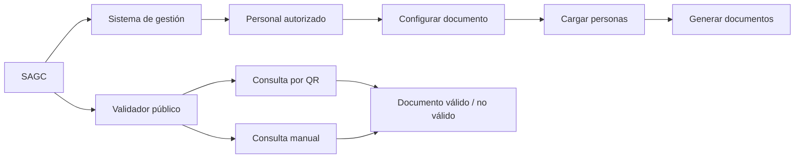
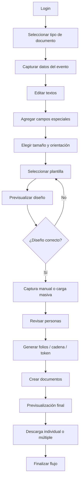
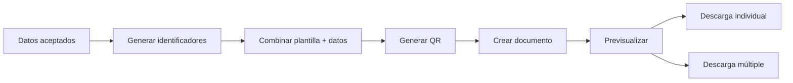
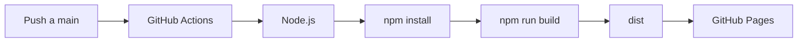

<div align="center">
  

  # SAGC

  ## Sistema Automatizado de Gestión de Constancias

  **Propuesta de desarrollo · Documento inicial de alcance funcional y técnico**

  <br />

  <a href="https://github.com/gio-canto/Sistema-automatizado-de-gesti-n-de-constancias-SAGC-">
    
  </a>
  <a href="https://gio-canto.github.io/Sistema-automatizado-de-gesti-n-de-constancias-SAGC-/">
    
  </a>
  <a href="https://github.com/gio-canto/Sistema-automatizado-de-gesti-n-de-constancias-SAGC-/actions">
    
  </a>

  <br /><br />

  
  
  
  
  
</div>

---

> [!IMPORTANT]
> **Este README describe una propuesta inicial.** El proyecto todavía se encuentra en levantamiento de requerimientos, diseño y validación. Varias funciones, campos, reglas de negocio y decisiones de arquitectura pueden cambiar conforme el Consejo revise y apruebe el sistema.

> [!WARNING]
> **Mantener el repositorio en privado durante el desarrollo interno.** No deben publicarse contraseñas reales, tokens, API keys, claves privadas, credenciales de bases de datos, archivos `.env` con secretos ni información personal real utilizada para pruebas.

---

# Contenido

- [1. Resumen ejecutivo](#1-resumen-ejecutivo)
- [2. Oportunidad detectada](#2-oportunidad-detectada)
- [3. Expectativas iniciales del Consejo](#3-expectativas-iniciales-del-consejo)
- [4. Propuesta SAGC](#4-propuesta-sagc)
- [5. Alcance funcional inicial](#5-alcance-funcional-inicial)
- [6. Flujo del usuario autorizado](#6-flujo-del-usuario-autorizado)
- [7. Validador público](#7-validador-público)
- [8. Administración de usuarios](#8-administración-de-usuarios)
- [9. Propuesta de backend y datos](#9-propuesta-de-backend-y-datos)
- [10. Reglas preliminares de folios, cadena y token](#10-reglas-preliminares-de-folios-cadena-y-token)
- [11. Plantillas y diseños](#11-plantillas-y-diseños)
- [12. Carga masiva y captura manual](#12-carga-masiva-y-captura-manual)
- [13. Generación y descarga](#13-generación-y-descarga)
- [14. Seguridad](#14-seguridad)
- [15. Estado actual del repositorio](#15-estado-actual-del-repositorio)
- [16. Roadmap](#16-roadmap)
- [17. Criterios de aceptación preliminares](#17-criterios-de-aceptación-preliminares)
- [18. Aspectos pendientes de definir](#18-aspectos-pendientes-de-definir)
- [19. Instalación](#19-instalación)
- [20. Ejecución y compilación](#20-ejecución-y-compilación)
- [21. Despliegue](#21-despliegue)
- [22. Estructura del repositorio](#22-estructura-del-repositorio)
- [23. Flujo de trabajo con Git](#23-flujo-de-trabajo-con-git)
- [24. Notas para el equipo](#24-notas-para-el-equipo)

---

# 1. Resumen ejecutivo

El **Sistema Automatizado de Gestión de Constancias (SAGC)** surge como una propuesta de los alumnos de modalidad dual para atender una oportunidad detectada dentro del **Consejo de Ciencia, Tecnología e Innovación del Estado de Guerrero**.

La propuesta busca construir una plataforma capaz de **gestionar, generar, descargar y validar documentos institucionales**, reduciendo tareas manuales y creando un proceso más consistente para la emisión de constancias y documentos relacionados.

El planteamiento inicial divide el sistema en dos grandes componentes:



### Sistema de gestión

Accesible únicamente para personal autorizado del Consejo. Permitirá preparar documentos, cargar información de participantes, generar folios y producir los archivos finales.

### Validador público

Accesible para cualquier persona que necesite comprobar la autenticidad de una constancia mediante un QR o mediante una búsqueda manual.

---

# 2. Oportunidad detectada

El proyecto parte de una necesidad operativa: disponer de una herramienta central para gestionar la creación y validación de constancias sin depender de múltiples procesos separados.

La propuesta pretende concentrar en un mismo flujo:

- configuración del tipo de documento;
- configuración del evento;
- edición de textos institucionales;
- selección o carga de plantillas;
- captura individual o masiva de personas;
- generación de identificadores;
- previsualización;
- exportación;
- validación pública posterior.

El objetivo no es únicamente “hacer PDFs”, sino crear un **proceso trazable de emisión documental**.

---

# 3. Expectativas iniciales del Consejo

A partir de la propuesta funcional actual, se identifican las siguientes expectativas iniciales.

| Área | Expectativa inicial |
|---|---|
| Acceso | Solo el personal autorizado debe entrar al sistema de gestión |
| Documentos | Poder generar constancias, diplomas, reconocimientos, acreditaciones y documentos personalizados |
| Eventos | Registrar información básica del evento asociado a la emisión |
| Textos | Permitir modificar textos antes de generar documentos |
| Campos variables | Permitir campos especiales como proyecto, área, modalidad u otros |
| Formato | Seleccionar tamaño y orientación del documento |
| Plantillas | Utilizar diseños base o diseños personalizados |
| Vista previa | Revisar el diseño antes de procesar la emisión |
| Datos | Permitir captura manual y carga masiva |
| Correcciones | Revisar y corregir los datos antes de generar |
| Identificación | Generar folio, cadena de validación y token único |
| QR | Incorporar una ruta de validación en los documentos |
| Descarga | Descargar un documento o varios documentos agrupados |
| Validación | Consultar documentos por QR o mediante nombre + folio |
| Administración | Manejar usuarios con distintos permisos |
| Seguridad | Almacenar contraseñas mediante hash y evitar credenciales en texto plano |

Estas expectativas representan la base del proyecto, no el alcance contractual definitivo.

---

# 4. Propuesta SAGC

La propuesta consiste en desarrollar un sistema web modular que acompañe todo el ciclo de emisión:

```text
INICIO
  ↓
Autenticación
  ↓
Tipo de documento
  ↓
Datos del evento y textos
  ↓
Campos especiales
  ↓
Tamaño y orientación
  ↓
Selección / carga de plantilla
  ↓
Previsualización
  ↓
Carga masiva o captura manual
  ↓
Revisión y corrección de personas
  ↓
Generación de folios + cadena + token
  ↓
Generación de documentos
  ↓
Previsualización final
  ↓
Descarga individual / descarga múltiple
  ↓
FIN
```

Después de la emisión, el documento podrá ser consultado por el **validador público SAGC**.

---

# 5. Alcance funcional inicial

## Tipos de documento contemplados

La propuesta visual inicial contempla:

- Constancia
- Diploma
- Reconocimiento
- Acreditación
- Otros / Personalizado

La opción **Otros / Personalizado** permitirá definir un tipo documental que no se encuentre en el catálogo predefinido.

## Configuración de textos

El usuario autorizado podrá trabajar con bloques como:

```text
Institución emisora
Tipo de documento
Nombre del participante
Texto de participación
Lugar
Fecha
Autoridad emisora
Evento
```

También se plantea permitir **Markdown** en los textos configurables para determinados estilos o variables.

## Campos especiales

El sistema podrá manejar marcadores dinámicos, por ejemplo:

```text
{nombre}
{proyecto}
{area}
{modalidad}
{folio}
{token}
```

El catálogo definitivo de campos deberá aprobarse conforme se conozcan todos los casos reales de emisión.

---

# 6. Flujo del usuario autorizado



El sistema debe procurar que el usuario tenga una **pantalla de confirmación antes de cada operación irreversible**.

---

# 7. Validador público

El validador constituye la segunda parte fundamental del sistema.

## Método 1 — QR

El documento contendrá un QR que dirigirá directamente a una ruta de validación.

Ejemplo conceptual:

```text
https://cocytieg.gob.mx/sagc/validacion/?folio=...
```

La URL definitiva, parámetros y estructura deberán acordarse antes de producción.

## Método 2 — Búsqueda manual

El usuario podrá ingresar al menos:

```text
Nombre
Folio
```

El sistema consultará la base de datos y mostrará si el documento existe.

## Información prevista en una validación positiva

- tipo de documento;
- nombre del titular;
- proyecto o concepto asociado;
- área;
- modalidad;
- evento;
- folio;
- cadena;
- token único;
- autoridad emisora;
- fecha y lugar;
- estado de validación.

## Validación negativa

Cuando los datos no coincidan con un documento existente, el sistema mostrará un estado similar a:

> **Documento no válido. Compruebe nombre y folio.**

---

# 8. Administración de usuarios

SAGC contempla al menos dos niveles iniciales de acceso.

| Permiso | Descripción preliminar |
|---|---|
| `NORMAL` | Usuario autorizado para operar funciones ordinarias del SAGC |
| `ADMIN` | Usuario con capacidades administrativas y gestión de cuentas |

## Usuario normal

Podrá utilizar únicamente las funciones que le sean autorizadas para la emisión documental.

## Usuario administrador

La propuesta contempla una sección administrativa que permita:

- visualizar usuarios;
- crear usuarios;
- cambiar o asignar contraseña;
- activar o desactivar cuentas;
- asignar permisos;
- administrar fotografía de perfil;
- eliminar usuarios cuando corresponda;
- acceder a herramientas administrativas futuras.

> [!IMPORTANT]
> La administración de cuentas debe hacerse desde una interfaz controlada. No se deben crear usuarios manipulando directamente tablas desde herramientas del navegador o desde el frontend.

---

# 9. Propuesta de backend y datos

El documento conceptual plantea inicialmente cinco grupos principales de información:

```text
usuarios
   │
   ├── eventos
   ├── plantillas
   ├── constancias
   └── contador_folios
```

Esta estructura es **conceptual**. El diseño relacional definitivo deberá normalizar relaciones, llaves, índices, auditoría y restricciones.

## Tabla / colección `usuarios`

Ejemplo inicial:

```json
{
  "id_usuario": 1,
  "nombre": "Juan Alberto Martínez",
  "usuario": "juan.alberto",
  "password_hash": "$argon2id$...",
  "permiso": "ADMIN",
  "foto": "/uploads/users/1.webp",
  "activo": true,
  "fecha_creacion": "2026-09-03T11:45:00"
}
```

Campos preliminares:

| Campo | Propósito |
|---|---|
| `id_usuario` | Identificador interno |
| `nombre` | Nombre mostrado |
| `usuario` | Usuario para iniciar sesión |
| `password_hash` | Hash de contraseña |
| `permiso` | Rol o permiso |
| `foto` | Referencia a imagen de perfil |
| `activo` | Estado de la cuenta |
| `fecha_creacion` | Fecha de alta |

## Entidades adicionales propuestas

### `eventos`

Podrá contener, entre otros:

```text
id_evento
nombre_evento
fecha_inicio
fecha_fin
lugar
responsable
estado
fecha_creacion
```

### `plantillas`

```text
id_plantilla
nombre
categoria_documento
orientacion
tamano
archivo_imagen
activo
creado_por
fecha_creacion
```

### `constancias`

```text
id_constancia
id_evento
id_plantilla
nombre_persona
tipo_documento
folio
token_unico
cadena_validacion
datos_variables
fecha_emision
emitido_por
estado
```

### `contador_folios`

Debe ayudar a garantizar generación ordenada y evitar colisiones de folios.

> [!NOTE]
> Los nombres de campos anteriores son una propuesta técnica para comenzar a modelar el backend. Todavía pueden cambiar.

---

# 10. Reglas preliminares de folios, cadena y token

Cada documento emitido deberá contar con identificadores suficientes para poder comprobar su autenticidad.

## Folio

Identificador visible y entendible para el usuario.

Ejemplo conceptual:

```text
FGRO/26/1380
```

La convención definitiva debe determinar:

- prefijo;
- año;
- consecutivo;
- reinicio anual o global;
- comportamiento ante cancelaciones;
- reservas y concurrencia.

## Token único

Cada documento deberá recibir un **token único no reutilizable** asociado a su registro.

El token no debe depender únicamente del nombre o del folio.

## Cadena de validación

Se plantea una cadena adicional generada por el sistema para identificar la emisión y facilitar su comprobación.

La estructura exacta, algoritmo y firma futura siguen pendientes de definición.

---

# 11. Plantillas y diseños

SAGC contempla plantillas institucionales reutilizables y plantillas personalizadas.

## Plantillas base

Podrán existir diseños aprobados por el Consejo para los tipos de documento más frecuentes.

## Plantillas personalizadas

La propuesta contempla que un usuario autorizado pueda cargar un diseño propio dentro de los formatos permitidos.

Formatos candidatos:

```text
PDF
JPG / JPEG
PNG
TIFF
```

### Decisión funcional actual

Las plantillas personalizadas aprobadas para reutilización se almacenarán como recurso del sistema, vinculadas a su registro de plantilla, para poder seleccionarlas posteriormente sin volver a cargarlas en cada emisión.

### Revisión obligatoria

Antes de utilizar un diseño, SAGC deberá mostrar una previsualización para comprobar:

- orientación;
- dimensiones;
- márgenes;
- áreas de seguridad;
- legibilidad;
- posición de datos variables;
- QR;
- firmas y logotipos.

---

# 12. Carga masiva y captura manual

El usuario podrá elegir entre dos modalidades.

## Carga manual

Adecuada para una persona o cantidades pequeñas.

Debe permitir:

- agregar persona;
- editar persona;
- eliminar registro antes de emitir;
- revisar folio/token previo a generación cuando corresponda.

## Carga masiva

Pensada para eventos con múltiples participantes.

La propuesta contempla un archivo estructurado que el sistema pueda analizar y mostrar antes de aceptar definitivamente los datos.

Formatos inicialmente considerados:

```text
.xlsx
XML
.txt
```

> [!NOTE]
> El formato definitivo de importación y las columnas obligatorias siguen pendientes de definición. Es probable que `.xlsx` se utilice como formato principal por facilidad operativa.

## Paso obligatorio de validación

Después de importar, SAGC debe mostrar una tabla editable antes de generar documentos.

El usuario debe poder identificar:

- filas con errores;
- campos faltantes;
- valores incompatibles;
- duplicados;
- folios repetidos;
- datos que no correspondan a campos especiales definidos.

---

# 13. Generación y descarga

Después de aceptar los datos, el sistema realizará el proceso de generación.



## Descarga individual

Cada documento podrá descargarse por separado.

## Descarga múltiple

Para una emisión con varias personas, SAGC deberá permitir empaquetar los documentos.

Formato recomendado inicialmente:

```text
ZIP
```

No se considera necesario utilizar RAR como dependencia principal del sistema salvo que el Consejo lo solicite expresamente.

---

# 14. Seguridad

La seguridad deberá formar parte del diseño desde el backend, no solo de la interfaz.

## Autenticación

En producción:

- las contraseñas nunca deben almacenarse en texto plano;
- se recomienda `Argon2id` para hashing;
- el backend debe validar credenciales;
- el frontend nunca debe contener contraseñas válidas de producción;
- las sesiones deben expirar;
- las cuentas inactivas no deben poder iniciar sesión.

## Sesiones

Evaluar:

```text
Cookies HttpOnly
Secure
SameSite
Expiración de sesión
Revocación
Control de sesiones concurrentes
```

## Protección del backend

Implementar cuando corresponda:

- rate limiting;
- validación estricta de entradas;
- protección CSRF;
- control de roles;
- logs de auditoría;
- registros de creación, modificación, emisión y cancelación;
- restricciones de tamaño y tipo de archivos;
- sanitización de archivos cargados;
- validación server-side del CAPTCHA real.

## Información que nunca debe ir al repositorio

```text
Contraseñas reales
Tokens de producción
API keys
Claves privadas
Credenciales de base de datos
Secrets
Archivos .env con información sensible
Respaldos de base de datos con datos personales
```

---

# 15. Estado actual del repositorio

Actualmente el repositorio representa la **fase inicial del frontend**.

### Implementado o en prototipo

- React + Vite;
- CSS institucional de acceso;
- pantalla de login;
- usuario de prueba local;
- campo de contraseña;
- mostrar/ocultar contraseña;
- CAPTCHA local simulado;
- carrusel de imágenes;
- logo institucional;
- pantalla básica posterior al acceso;
- GitHub Actions;
- despliegue de frontend mediante GitHub Pages.

### Todavía no implementado como sistema real

- backend;
- base de datos;
- autenticación real;
- administración de usuarios;
- eventos;
- plantillas persistentes;
- carga masiva;
- captura manual completa;
- generación de PDF;
- QR real;
- folios;
- token único real;
- cadena de validación;
- validador público;
- auditoría;
- panel de producción.

> [!CAUTION]
> El usuario `demo` actual sirve únicamente para probar la interfaz. No constituye autenticación segura.

---

# 16. Roadmap

## Fase 0 — Base visual

- [x] Crear proyecto React + Vite
- [x] Configurar CSS inicial
- [x] Crear login visual
- [x] Integrar identidad institucional
- [x] Preparar despliegue de frontend

## Fase 1 — Backend y autenticación

- [ ] Seleccionar tecnología de backend
- [ ] Configurar base de datos
- [ ] Crear modelo `usuarios`
- [ ] Implementar Argon2id
- [ ] Crear endpoint de login
- [ ] Crear sesiones
- [ ] Roles `NORMAL` y `ADMIN`
- [ ] Eliminar credenciales locales del frontend

## Fase 2 — Administración

- [ ] Dashboard inicial
- [ ] Crear usuario
- [ ] Editar usuario
- [ ] Activar/desactivar usuario
- [ ] Asignar roles
- [ ] Fotografía de perfil
- [ ] Auditoría administrativa

## Fase 3 — Configuración documental

- [ ] Tipos de documento
- [ ] Eventos
- [ ] Textos
- [ ] Markdown permitido
- [ ] Campos especiales
- [ ] Tamaño
- [ ] Orientación

## Fase 4 — Plantillas

- [ ] Plantillas institucionales
- [ ] Carga personalizada
- [ ] Almacenamiento reutilizable
- [ ] Previsualización
- [ ] Validación de dimensiones

## Fase 5 — Personas y emisión

- [ ] Captura manual
- [ ] Formato `.xlsx`
- [ ] Carga masiva
- [ ] Tabla de revisión
- [ ] Edición previa
- [ ] Folios
- [ ] Token único
- [ ] Cadena de validación
- [ ] Generación de QR

## Fase 6 — Documentos

- [ ] Motor de composición
- [ ] Generación PDF
- [ ] Previsualización
- [ ] Descarga individual
- [ ] ZIP múltiple
- [ ] Registro de emisión

## Fase 7 — Validador público

- [ ] Ruta pública
- [ ] Validación por QR
- [ ] Validación manual
- [ ] Vista documento válido
- [ ] Vista documento inválido
- [ ] Protección contra abuso

## Fase 8 — Producción

- [ ] Pruebas funcionales
- [ ] Pruebas de seguridad
- [ ] Revisión con usuarios del Consejo
- [ ] Correcciones finales
- [ ] Documentación
- [ ] Backups
- [ ] Migraciones
- [ ] Despliegue institucional

---

# 17. Criterios de aceptación preliminares

El proyecto podrá considerarse funcionalmente completo cuando, como mínimo, permita demostrar este escenario:

1. Un administrador crea un usuario autorizado.
2. El usuario inicia sesión con credenciales reales.
3. El usuario crea o selecciona un evento.
4. Selecciona el tipo de documento.
5. Configura textos y campos especiales.
6. Selecciona una plantilla institucional o personalizada.
7. Previsualiza y acepta el diseño.
8. Carga un archivo con participantes o los registra manualmente.
9. SAGC valida los datos y permite corregir errores.
10. El usuario acepta la emisión.
11. SAGC genera folio, token único, cadena y QR.
12. Se crea un documento por participante.
13. El operador descarga individualmente o en ZIP.
14. Una persona escanea el QR.
15. El validador público identifica el documento y muestra sus datos.
16. Una búsqueda con información inválida devuelve un resultado negativo.
17. Toda operación sensible queda registrada en auditoría.

---

# 18. Aspectos pendientes de definir

Esta sección es deliberadamente visible porque el proyecto **todavía está en levantamiento de requerimientos**.

## Negocio

- [ ] Tipos documentales definitivos
- [ ] Catálogo de eventos
- [ ] Quién puede crear eventos
- [ ] Quién puede aprobar plantillas
- [ ] Quién puede emitir documentos
- [ ] Quién puede cancelar documentos
- [ ] Procedimiento para reexpediciones
- [ ] Convención oficial de folios
- [ ] Reglas de documentos cancelados
- [ ] Datos que el validador podrá mostrar públicamente

## Plantillas

- [ ] Dimensiones oficiales
- [ ] Áreas de seguridad
- [ ] Reglas para logotipos
- [ ] Resolución mínima
- [ ] Tamaño máximo de archivo
- [ ] Formatos definitivos aceptados
- [ ] Versionado de plantillas

## Datos

- [ ] Columnas definitivas del `.xlsx`
- [ ] Reglas de normalización de nombres
- [ ] Campos obligatorios
- [ ] Detección de duplicados
- [ ] Política de datos personales
- [ ] Tiempo de conservación

## Seguridad

- [ ] Duración de sesión
- [ ] Política de contraseñas
- [ ] Recuperación de cuenta
- [ ] 2FA para administradores
- [ ] CAPTCHA de producción
- [ ] Logs de auditoría requeridos

## Infraestructura

- [ ] Backend definitivo
- [ ] Motor de base de datos
- [ ] Servidor institucional
- [ ] Dominio final
- [ ] HTTPS
- [ ] Sistema de almacenamiento de archivos
- [ ] Estrategia de backups
- [ ] Ambiente de pruebas
- [ ] Ambiente de producción

---

# 19. Instalación

## Requisitos

- Git
- Node.js 20 o superior
- npm
- acceso autorizado al repositorio
- Visual Studio Code u otro editor

Comprobar herramientas:

```bash
node --version
npm --version
git --version
```

## Clonar

```bash
git clone https://github.com/gio-canto/Sistema-automatizado-de-gesti-n-de-constancias-SAGC-.git
```

Entrar al proyecto:

```bash
cd Sistema-automatizado-de-gesti-n-de-constancias-SAGC-
```

Instalar dependencias:

```bash
npm install
```

---

# 20. Ejecución y compilación

## Desarrollo

```bash
npm run dev
```

Vite mostrará una URL similar a:

```text
http://localhost:5173/
```

## Compilar

```bash
npm run build
```

La compilación se generará en:

```text
dist/
```

## Probar compilación

```bash
npm run preview
```

---

# 21. Despliegue

El repositorio incluye:

```text
.github/workflows/deploy-pages.yml
```

Flujo actual:



Prototipo:

**https://gio-canto.github.io/Sistema-automatizado-de-gesti-n-de-constancias-SAGC-/**

Actions:

**https://github.com/gio-canto/Sistema-automatizado-de-gesti-n-de-constancias-SAGC-/actions**

> [!WARNING]
> GitHub Pages es adecuado para mostrar el frontend estático del prototipo. El SAGC completo requerirá infraestructura capaz de ejecutar backend, base de datos, autenticación y almacenamiento seguro.

---

# 22. Estructura del repositorio

Estructura actual simplificada:

```text
Sistema-automatizado-de-gesti-n-de-constancias-SAGC-/
│
├── .github/
│   └── workflows/
│       └── deploy-pages.yml
│
├── App.jsx
├── index.html
├── main.jsx
├── package.json
├── README.md
├── styles.css
└── vite.config.js
```

| Archivo | Función actual |
|---|---|
| `App.jsx` | Interfaz y lógica del prototipo de login |
| `styles.css` | Diseño visual y responsive |
| `main.jsx` | Entrada de React |
| `index.html` | Documento HTML principal |
| `package.json` | Dependencias y scripts |
| `vite.config.js` | Configuración de Vite |
| `README.md` | Alcance, propuesta y documentación del proyecto |
| `deploy-pages.yml` | Despliegue automatizado del frontend |

La estructura crecerá cuando se implemente backend.

Una organización futura posible:

```text
sagc/
├── frontend/
├── backend/
├── database/
├── docs/
├── tests/
└── scripts/
```

Esto todavía no constituye una decisión definitiva.

---

# 23. Flujo de trabajo con Git

Revisar cambios:

```bash
git status
```

Agregar:

```bash
git add .
```

Crear commit:

```bash
git commit -m "Descripción clara del cambio"
```

Subir:

```bash
git push origin main
```

## Recomendación para cuando el equipo crezca

Evitar trabajar todo directamente sobre `main`.

Flujo recomendado:

```text
main
 └── develop
      ├── feature/login-backend
      ├── feature/usuarios
      ├── feature/plantillas
      ├── feature/carga-masiva
      └── feature/validador
```

Después, integrar mediante Pull Request y revisión.

---

# 24. Notas para el equipo

### Este documento debe actualizarse junto con el proyecto

Cuando el Consejo confirme una regla de negocio, debe pasar de **pendiente** a **definida** en este README o en documentación técnica específica.

### No asumir requerimientos

Si una función no ha sido validada, debe documentarse como:

```text
PROPUESTA
POR DEFINIR
PENDIENTE DE VALIDACIÓN
```

No como requisito definitivo.

### Separar claramente tres niveles

```text
1. EXPECTATIVA DEL CONSEJO
2. PROPUESTA DEL EQUIPO
3. IMPLEMENTACIÓN ACTUAL
```

Esto evitará que un prototipo visual se interprete como comportamiento final del sistema.

---

<div align="center">

## SAGC

**Sistema Automatizado de Gestión de Constancias**

Proyecto en desarrollo dentro del contexto de la modalidad dual y del levantamiento inicial de necesidades del Consejo de Ciencia, Tecnología e Innovación del Estado de Guerrero.

**Estado: propuesta inicial · sujeto a revisión y ampliación**

</div>
