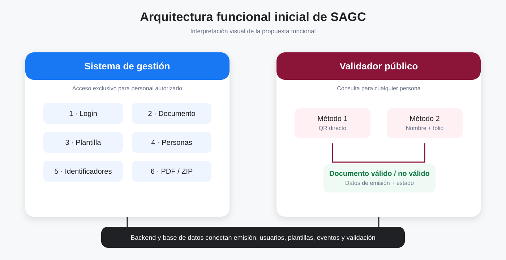
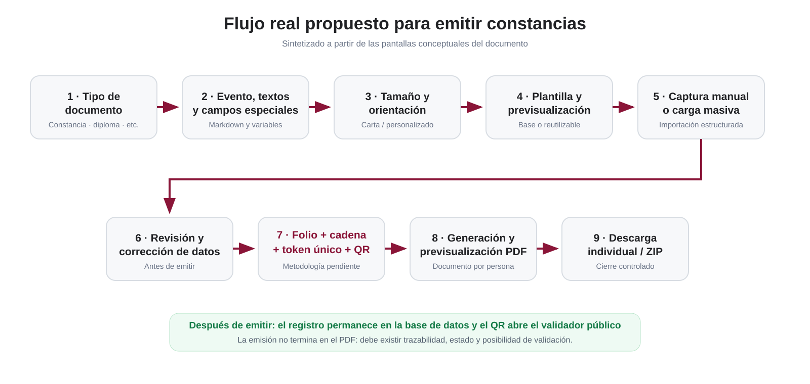
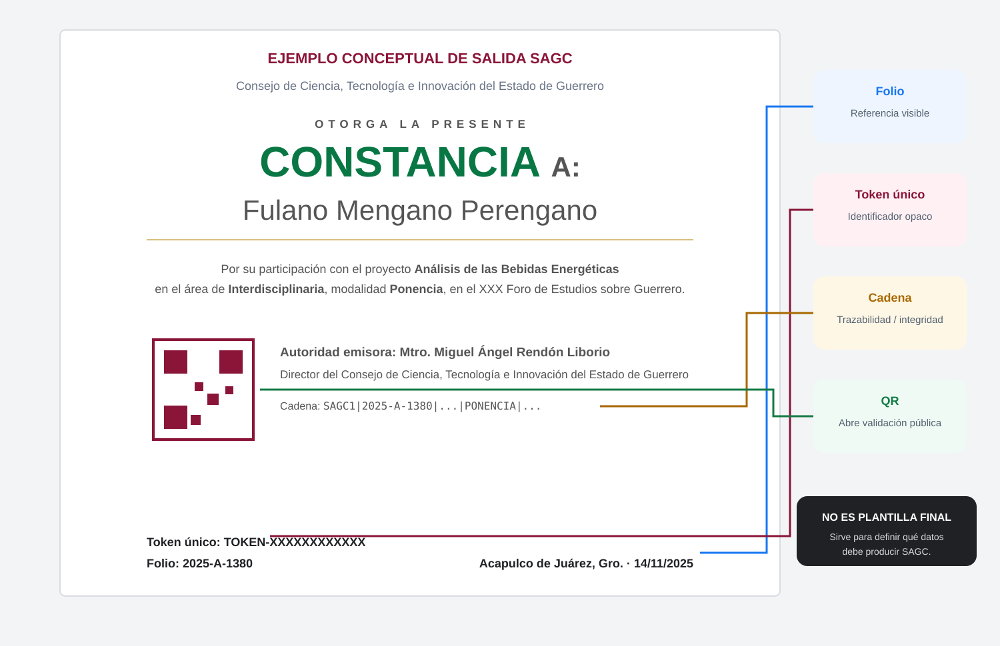
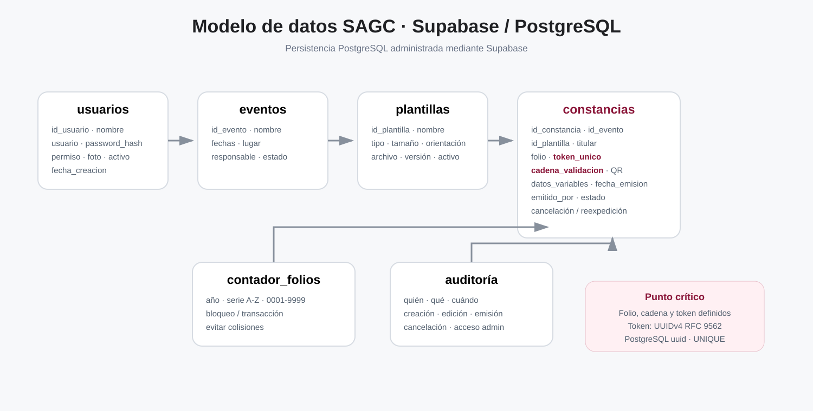

<div align="center">
  

  # SAGC

  ## Sistema Automatizado de Gestión de Constancias

  **Documento maestro inicial de alcance funcional, visual y técnico**

  <br />

  <a href="https://github.com/gio-canto/Sistema-automatizado-de-gesti-n-de-constancias-SAGC-">
    
  </a>
  <a href="https://gio-canto.github.io/Sistema-automatizado-de-gesti-n-de-constancias-SAGC-/">
    
  </a>
  <a href="https://github.com/gio-canto/Sistema-automatizado-de-gesti-n-de-constancias-SAGC-/actions">
    
  </a>

  <br /><br />

  
  
  
  
  
</div>

---

> [!IMPORTANT]
> Este README no representa todavía una especificación contractual final. Resume lo observado en la propuesta visual, el ejemplo real de constancia entregado como referencia y las decisiones técnicas iniciales del equipo. Todo requisito deberá validarse con el Consejo antes de considerarse definitivo.

> [!WARNING]
> **Mantener el repositorio privado durante el desarrollo interno.** Si el repositorio aparece público, revisar la visibilidad antes de incorporar backend, esquemas definitivos, documentación interna, secretos o datos de prueba sensibles.

---

# 1. Qué se va a construir realmente

SAGC no será solamente un generador de PDF.

El sistema deberá cubrir el ciclo completo de una emisión documental:

1. acceso de personal autorizado;
2. configuración del documento y del evento;
3. definición de textos y campos variables;
4. selección o carga de plantilla;
5. captura manual o carga masiva de personas;
6. revisión de la información;
7. creación automática de folio, cadena, token único y QR;
8. composición del documento;
9. previsualización;
10. descarga;
11. persistencia del registro emitido;
12. validación pública posterior.

El proyecto se divide en dos productos conectados:

<p align="center">
  
</p>

### A. Sistema de gestión

Uso exclusivo de personal autorizado.

Responsable de:

- usuarios;
- eventos;
- tipos de documento;
- textos;
- campos especiales;
- plantillas;
- participantes;
- emisión;
- folios;
- cadena;
- token;
- QR;
- PDF;
- descargas;
- auditoría.

### B. Validador público

Acceso público para comprobar documentos emitidos.

Debe permitir:

- validación directa mediante QR;
- consulta manual;
- mostrar documento válido;
- mostrar documento cancelado, cuando aplique;
- mostrar documento no encontrado o no válido.

---

# 2. Lectura visual de la propuesta

El análisis de las pantallas conceptuales permite identificar un flujo mucho más preciso que el descrito inicialmente solo en texto.

<p align="center">
  
</p>

## Flujo funcional esperado

```text
LOGIN
  ↓
TIPO DE DOCUMENTO
  ↓
DATOS DEL EVENTO
  ↓
TEXTOS
  ↓
CAMPOS ESPECIALES
  ↓
TAMAÑO Y ORIENTACIÓN
  ↓
PLANTILLA
  ↓
PREVISUALIZACIÓN
  ↓
CAPTURA MANUAL / CARGA MASIVA
  ↓
REVISIÓN Y CORRECCIÓN
  ↓
GENERACIÓN DE IDENTIFICADORES
  ↓
GENERACIÓN DE DOCUMENTOS
  ↓
PREVISUALIZACIÓN FINAL
  ↓
DESCARGA
  ↓
REGISTRO PERSISTENTE
  ↓
VALIDADOR PÚBLICO
```

---

# 3. Tipos de documento

La propuesta visual contempla como mínimo:

- Constancia
- Diploma
- Reconocimiento
- Acreditación
- Otros / Personalizado

La arquitectura no debe codificar estos tipos como pantallas separadas e irrepetibles.

Se recomienda tratarlos como un catálogo configurable:

```text
tipo_documento
├── id
├── nombre
├── activo
├── plantilla_default
├── reglas
└── campos_base
```

La opción **Otros / Personalizado** deberá permitir crear una emisión que no dependa de uno de los tipos preconfigurados.

---

# 4. Eventos, textos y campos especiales

La propuesta visual muestra una pantalla donde el operador puede definir:

- nombre del evento;
- ID del evento;
- institución emisora;
- encabezados;
- tipo de reconocimiento;
- texto principal;
- lugar;
- fecha;
- autoridad;
- colores por sección;
- campos especiales;
- contenido con Markdown.

## Campos especiales

El concepto de campos especiales es central porque permite que una misma plantilla funcione con distintos datos.

Ejemplos:

```text
{nombre}
{proyecto}
{area}
{modalidad}
{folio}
{fecha}
{evento}
{token}
```

El sistema deberá permitir definir nuevos campos antes de la captura de participantes.

### Regla importante

Los campos especiales creados para una emisión deben propagarse automáticamente a:

- captura manual;
- formato de carga masiva;
- validación de datos;
- composición de la constancia.

---

# 5. Plantillas y diseño

La propuesta visual muestra:

- plantillas básicas;
- plantillas personalizadas;
- descarga de guía;
- carga de archivo;
- previsualización;
- aceptación o rechazo;
- opción de guardar diseño.

## Decisión funcional para SAGC

Las plantillas podrán tener dos comportamientos:

### Plantilla temporal

Se usa únicamente para una emisión y puede eliminarse después de terminar el proceso, de acuerdo con la política que defina el Consejo.

### Plantilla reutilizable

Se guarda en SAGC y queda disponible en futuras emisiones.

Debe contener al menos:

```text
id_plantilla
nombre
tipo_documento
version
orientacion
tamano
archivo
miniatura
activo
creado_por
fecha_creacion
```

> [!IMPORTANT]
> La versión final debe resolver la contradicción del prototipo visual entre “no almacenar” el archivo personalizado y “guardar diseño”. La propuesta técnica actual es permitir ambos modos: temporal o reutilizable.

## Formatos candidatos

- PDF
- PNG
- JPG/JPEG
- TIFF

El backend deberá validar:

- dimensiones;
- orientación;
- peso;
- MIME real;
- resolución;
- áreas de seguridad.

---

# 6. Captura manual y carga masiva

La propuesta visual separa claramente ambos métodos.

## Manual

Pensado para:

- una persona;
- grupos pequeños;
- correcciones;
- altas adicionales.

Debe permitir:

- agregar;
- editar;
- eliminar antes de emitir;
- validar campos obligatorios.

## Masiva

Pensada para eventos con gran cantidad de personas.

Formato principal propuesto:

```text
.xlsx
```

Otros formatos solo deberán habilitarse si existe una necesidad real.

### La carga no genera inmediatamente los documentos

Primero debe existir una pantalla de revisión.

SAGC deberá detectar:

- campos vacíos;
- datos inválidos;
- duplicados;
- columnas desconocidas;
- campos especiales faltantes;
- folios repetidos, si existieran datos heredados;
- errores de tipo.

---

# 7. Folio, cadena, token único y QR

Esta parte debe considerarse **un subsistema propio**.

No se debe implementar con concatenaciones improvisadas dentro del frontend.

## Folio Único SAGC V1

La metodología oficial está definida en:

**[`docs/METODOLOGIA_FOLIO_UNICO.md`](./docs/METODOLOGIA_FOLIO_UNICO.md)**

Formato:

```text
AAAA-X-XXXX
```

Secuencia:

```text
2026-A-0001
...
2026-A-9999
2026-B-0001
...
2026-Z-9999
2027-A-0001
```

Reglas:

- `AAAA` es el año de emisión;
- la serie inicia en `A`;
- el consecutivo inicia en `0001`;
- al llegar a `9999`, la siguiente emisión avanza a la serie consecutiva y reinicia en `0001`;
- al cambiar de año, vuelve a `A-0001`;
- un folio cancelado nunca se reutiliza;
- `Z-9999` agota la capacidad anual;
- la asignación se realiza únicamente en backend mediante transacción y bloqueo de fila.

Capacidad máxima por año:

```text
26 × 9,999 = 259,974 folios
```

Implementación de referencia:

```text
server/src/services/identifiers/folio.js
```

Prueba:

```bash
npm --prefix server run folio:test
```

## Token único

El ejemplo visual incorpora un token individual por constancia.

### Decisión propuesta

El token:

- debe generarse en el servidor;
- debe ser único;
- debe ser impredecible;
- no debe ser ingresado manualmente;
- no debe derivarse solamente del nombre o del folio;
- no debe poder editarse desde la pantalla del operador.

Se recomienda evaluar un identificador generado mediante CSPRNG con suficiente entropía y codificación segura para URL.

## Cadena Original SAGC

La metodología técnica vigente ya está definida en:

**[`docs/METODOLOGIA_CADENA_ORIGINAL.md`](./docs/METODOLOGIA_CADENA_ORIGINAL.md)**

Formato oficial:

```text
FOLIO|NOMBRE_NORMALIZADO|FECHA|TIPO_DOCUMENTO|NOMBRE_EVENTO_NORMALIZADO|TOKEN_UNICO
```

Ejemplo:

```text
2026-A-1380|MARIA-JOSE-MUNOZ-LOPEZ|2026-09-08|CONSTANCIA|XXX-FORO-DE-ESTUDIOS-SOBRE-GUERRERO|8F3A7C21-D4E9-5B60-9A01-7E2C4B6D8F10
```

La cadena:

- se genera exclusivamente en backend;
- es determinista;
- se almacena en `constancias.cadena_validacion`;
- no puede editarse manualmente;
- permanece inmutable después de emitir;
- no lleva prefijo de versión dentro de la cadena; el versionado se controla en documentación y código.

La cadena original se utilizará como dato de trazabilidad y comparación dentro de SAGC. No se aplicará una capa criptográfica adicional a las constancias.

---

# 8. Metodología de identificadores

## 8.1 Cadena Original SAGC — definida

La especificación normativa se encuentra en:

**[`docs/METODOLOGIA_CADENA_ORIGINAL.md`](./docs/METODOLOGIA_CADENA_ORIGINAL.md)**

La cadena contiene exactamente seis bloques:

```text
FOLIO|NOMBRE_NORMALIZADO|FECHA|TIPO_DOCUMENTO|NOMBRE_EVENTO_NORMALIZADO|TOKEN_UNICO
```

### Datos utilizados

```text
folio
nombre_persona
fecha_emision
tipos_documento.clave
eventos.nombre
token_unico
```

### Reglas principales

- UTF-8;
- orden de campos invariable;
- fecha `YYYY-MM-DD`;
- nombre normalizado sin diacríticos, en mayúsculas y separado por guiones;
- folio validado con formato `AAAA-X-XXXX`;
- tipo documental obtenido de su `clave`;
- evento de emisión obtenido del nombre almacenado en `eventos.nombre`;
- token conservado sin alterar mayúsculas/minúsculas;
- escape de `%`, `|`, CR y LF;
- máximo 1024 bytes;
- generación únicamente server-side;
- persistencia exacta en `cadena_validacion`;
- inmutabilidad después de emisión.

### Vector oficial

Entrada:

```text
2026-A-1380
María José Muñoz López
2026-09-08
CONSTANCIA
XXX Foro de Estudios sobre Guerrero
8F3A7C21-D4E9-5B60-9A01-7E2C4B6D8F10
```

Salida:

```text
2026-A-1380|MARIA-JOSE-MUNOZ-LOPEZ|2026-09-08|CONSTANCIA|XXX-FORO-DE-ESTUDIOS-SOBRE-GUERRERO|8F3A7C21-D4E9-5B60-9A01-7E2C4B6D8F10
```

Implementación de referencia:

```text
server/src/services/identifiers/cadena-original.js
```

Prueba ejecutable:

```bash
npm --prefix server run chain:test
```

## 8.2 Token único — pendiente de metodología propia

La cadena vigente ya define **cómo consume** el token, pero todavía debe fijarse formalmente:

- algoritmo de generación;
- número de bits de entropía;
- longitud;
- alfabeto/codificación;
- política ante colisiones;
- exposición pública;
- comportamiento institucional ante reexpedición.

El token debe continuar siendo generado en backend, único, impredecible y no editable.

## 8.3 Validación del registro

SAGC validará las constancias mediante su registro persistido, folio, token/QR, cadena original y estado de emisión.

La validación se apoyará en el registro almacenado en Supabase/PostgreSQL, el folio, el token/QR, la cadena original y el estado de la emisión.

## 8.4 QR

La recomendación permanece:

```text
https://dominio/sagc/validacion/<token>
```

La cadena completa no debe colocarse en la URL porque contiene el nombre normalizado del titular.

## 8.5 Cancelación y reexpedición

Regla técnica vigente:

- una cancelación no modifica folio, token ni cadena original;
- el estado cambia a `CANCELADA`;
- una reexpedición crea una nueva emisión y una nueva cadena;
- la relación con la emisión anterior se conserva mediante `id_constancia_origen`.

---

# 9. Qué debe producir una constancia SAGC

El segundo PDF de referencia permite definir con mayor precisión el resultado esperado.

La constancia final no es solo una imagen con un nombre.

Debe poder contener:

- identidad institucional;
- tipo de documento;
- nombre;
- motivo;
- proyecto;
- área;
- modalidad;
- evento;
- autoridad;
- QR;
- cadena;
- token;
- folio;
- fecha;
- lugar.

<p align="center">
  
</p>

> [!NOTE]
> La ilustración anterior no pretende reemplazar la plantilla oficial. Su función es documentar qué información tiene que ser capaz de producir el motor de composición.

## Mejora sobre el prototipo visual

En las pantallas conceptuales aparece un campo **Token Único** dentro de la edición individual.

En la implementación final:

```text
folio        → generado por SAGC
token_unico  → generado por SAGC
cadena       → generada por SAGC
qr           → generado por SAGC
```

No deberán ser campos de entrada ordinaria.

---

# 10. Generación del documento

El motor deberá separar:

```text
PLANTILLA
+
DATOS DEL EVENTO
+
DATOS DEL PARTICIPANTE
+
IDENTIFICADORES
+
QR
=
DOCUMENTO FINAL
```

Se recomienda que la generación ocurra en backend o en un servicio controlado.

Debe producir al menos:

- PDF final;
- vista previa;
- miniatura opcional;
- registro de emisión;
- asociación con la constancia en base de datos.

---

# 11. Descarga y cierre

El prototipo contempla:

- descarga individual;
- descarga de todos;
- confirmación antes de terminar.

## Decisión propuesta

Descarga múltiple:

```text
ZIP
```

RAR no se considera necesario salvo requerimiento explícito.

### Terminar no debe borrar la trazabilidad

Cuando el usuario finaliza:

- los PDF temporales pueden limpiarse según política;
- los registros emitidos no deben desaparecer;
- folio, token, cadena, estado y auditoría deben persistir;
- las plantillas reutilizables deben permanecer.

---

# 12. Validador público

## Método principal: QR

El QR abre directamente el registro correspondiente.

## Método alterno

Formulario con:

- nombre;
- folio;
- CAPTCHA cuando sea necesario.

## Documento válido

Puede mostrar:

- tipo;
- titular;
- evento;
- proyecto;
- área;
- modalidad;
- folio;
- autoridad;
- fecha;
- estado.

La exposición pública completa de cadena y token deberá definirse con el Consejo.

## Documento no válido

Debe mostrar un mensaje inequívoco sin revelar información de terceros.

---

# 13. Administración de usuarios

La propuesta contempla dos roles iniciales:

| Rol | Uso |
|---|---|
| NORMAL | Operación ordinaria |
| ADMIN | Administración de usuarios y funciones reservadas |

ADMIN deberá poder:

- crear usuario;
- editar usuario;
- cambiar o restablecer contraseña;
- activar/desactivar;
- asignar rol;
- administrar fotografía;
- consultar auditoría;
- eliminar, si la política lo permite.

> [!CAUTION]
> La imagen conceptual de una “consola” o almacenamiento del navegador no debe trasladarse a producción. La administración real debe operar contra el backend y la base de datos con autorización server-side.

---

# 14. Backend y base de datos

El documento visual propone inicialmente:

```text
usuarios
eventos
plantillas
constancias
contador_folios
```

Para un sistema real se recomienda incorporar además auditoría y versionado donde corresponda.

<p align="center">
  
</p>

## usuarios

```text
id_usuario
nombre
usuario
password_hash
permiso
foto
activo
fecha_creacion
```

Hash recomendado a evaluar:

```text
Argon2id
```

## eventos

```text
id_evento
nombre
fecha_inicio
fecha_fin
lugar
responsable
estado
fecha_creacion
```

## plantillas

```text
id_plantilla
nombre
tipo_documento
version
orientacion
tamano
archivo
miniatura
activo
creado_por
fecha_creacion
```

## constancias

```text
id_constancia
id_evento
id_plantilla
tipo_documento
nombre_persona
datos_variables
folio
token_unico
cadena_validacion
qr_destino
fecha_emision
emitido_por
estado
id_constancia_origen
```

## contador_folios

```text
anio
serie
ultimo_valor
fecha_actualizacion
```

Implementa el estado del Folio Único SAGC V1. Debe garantizar concurrencia mediante transacción y bloqueo de fila.

## auditoria

Propuesta adicional necesaria para producción:

```text
id_log
id_usuario
accion
entidad
id_entidad
fecha
ip
metadata
```

---

# 15. Seguridad mínima

Antes de utilizar datos reales:

- backend de autenticación;
- hash de contraseñas;
- sesiones seguras;
- HTTPS;
- control de roles server-side;
- rate limiting;
- validación de archivos;
- CAPTCHA validado en servidor;
- auditoría;
- protección CSRF cuando aplique;
- sanitización de Markdown;
- límites de carga;
- backups;
- política de datos personales.

Nunca subir:

```text
contraseñas reales
API keys
tokens de producción
claves privadas
credenciales de BD
.env con secretos
respaldos con datos personales
```

---

# 16. Estado actual del repositorio

## Actualmente implementado

- React + Vite + CSS;
- login visual y acceso de prototipo `demo/demo`;
- carrusel de imágenes y estilo Liquid Glass;
- workflow de GitHub Pages;
- API Node.js/Express;
- cliente backend `@supabase/supabase-js`;
- esquema oficial PostgreSQL para Supabase;
- RLS habilitado en las tablas SAGC;
- acceso elevado limitado al backend mediante clave secreta;
- endpoint de salud de Supabase/PostgreSQL;
- validación de login contra `usuarios` en Supabase;
- bootstrap de administrador con Argon2id;
- Folio Único SAGC V1;
- función PostgreSQL atómica `asignar_siguiente_folio(date)`;
- Cadena Original SAGC;
- catálogos iniciales y smoke test PostgreSQL;
- guía de instalación de Supabase/PostgreSQL.

## Aún por desarrollar

- sesiones seguras de autenticación;
- administración completa de usuarios;
- CRUD de eventos;
- tipos documentales desde interfaz;
- editor de textos;
- campos especiales;
- plantillas persistentes;
- importación XLSX;
- revisión de datos;
- integración completa de folio + emisión;
- metodología definitiva del token único;
- generación del QR;
- motor PDF;
- ZIP;
- validador público;
- auditoría funcional.

---

# 17. Roadmap técnico

## Fase 0 — Frontend base

- [x] React + Vite
- [x] Login
- [x] Identidad visual
- [x] GitHub Pages
- [x] README de alcance
- [x] Diagramas visuales del proyecto

## Fase 1 — Especificación

- [ ] Validar flujo con el Consejo
- [ ] Definir casos de uso reales
- [ ] Definir permisos
- [ ] Definir tipos documentales
- [ ] Definir formato XLSX
- [ ] Definir política de plantillas
- [x] **Definir metodología de Cadena Original SAGC**
- [ ] Definir metodología del token único
- [x] Definir metodología Folio Único SAGC V1
- [ ] Definir qué datos serán públicos

## Fase 2 — Backend y autenticación

- [x] Tecnología backend: Node.js + Express
- [x] Base de datos: Supabase + PostgreSQL
- [x] Estructura de migraciones PostgreSQL
- [x] Esquema de usuarios
- [x] Argon2id
- [ ] Login real
- [ ] Sesiones
- [ ] Roles
- [ ] Auditoría inicial

## Fase 3 — Configuración documental

- [ ] Eventos
- [ ] Tipos
- [ ] Textos
- [ ] Campos especiales
- [ ] Markdown seguro
- [ ] Tamaño/orientación

## Fase 4 — Plantillas

- [ ] Plantillas base
- [ ] Personalizadas
- [ ] Temporales/reutilizables
- [ ] Versiones
- [ ] Previsualización

## Fase 5 — Participantes

- [ ] Manual
- [ ] XLSX
- [ ] Validación
- [ ] Correcciones
- [ ] Duplicados

## Fase 6 — Identificadores

- [x] Metodología Folio Único SAGC V1
- [x] Servicio transaccional de referencia del folio
- [ ] Integrar asignación del folio en la transacción completa de emisión
- [ ] Token
- [x] Metodología Cadena Original SAGC
- [x] Implementación de referencia y vector de prueba de cadena
- [ ] Integrar cadena al flujo real de emisión
- [ ] QR
- [ ] Pruebas integrales

## Fase 7 — Generación

- [ ] Motor de composición
- [ ] PDF
- [ ] Preview
- [ ] ZIP
- [ ] Registro persistente

## Fase 8 — Validador

- [ ] URL por token
- [ ] Consulta manual
- [ ] Estado válido
- [ ] Cancelado
- [ ] No válido
- [ ] Protección contra abuso

## Fase 9 — Producción

- [ ] QA
- [ ] Seguridad
- [ ] UAT con Consejo
- [ ] Backups
- [ ] Monitoreo
- [ ] Despliegue institucional

---

# 18. Criterio de aceptación del MVP funcional

El MVP deberá demostrar de extremo a extremo:

1. administrador crea un operador;
2. operador inicia sesión;
3. crea/selecciona evento;
4. selecciona tipo;
5. configura textos y variables;
6. selecciona plantilla;
7. carga participantes;
8. corrige errores;
9. acepta la emisión;
10. backend genera folio;
11. backend genera token;
12. backend genera cadena;
13. backend genera QR;
14. motor genera PDF;
15. usuario previsualiza;
16. descarga;
17. registro permanece en la BD;
18. QR abre validador;
19. documento aparece válido;
20. una consulta incorrecta devuelve no válido;
21. auditoría registra la operación.

---

# 19. Pendientes que deben resolverse con la empresa/Consejo

## Negocio

- [ ] tipos definitivos;
- [ ] responsables de autorización;
- [ ] reglas de cancelación;
- [ ] reglas de reexpedición;
- [ ] datos públicos;
- [ ] vigencia del documento;
- [ ] folio oficial.

## Cadena y token

- [x] metodología técnica de Cadena Original SAGC V2;
- [x] formato oficial de cadena sin prefijo de versión;
- [x] versionado de cadena;
- [x] reglas técnicas de cancelación/reexpedición de cadena;
- [ ] metodología formal del token;
- [ ] formato definitivo de token;
- [ ] URL institucional del QR;
- [ ] aprobación del Consejo sobre la metodología;
- [ ] datos mostrados al público.

## Plantillas

- [ ] formatos finales;
- [ ] tamaños;
- [ ] áreas seguras;
- [ ] almacenamiento;
- [ ] versionado;
- [ ] aprobaciones.

## Datos

- [ ] columnas XLSX;
- [ ] validaciones;
- [ ] duplicados;
- [ ] conservación;
- [ ] privacidad.

## Infraestructura

- [ ] backend;
- [ ] base de datos;
- [ ] almacenamiento;
- [ ] servidor;
- [ ] dominio;
- [ ] HTTPS;
- [ ] backups;
- [ ] producción/pruebas.

---

# 20. Instalación completa y trabajo local

La arquitectura oficial de SAGC es:

```text
GitHub
  ↓
React / Vite
  ↓ HTTP / JSON
Node.js / Express
  ↓ @supabase/supabase-js
Supabase
  ↓
PostgreSQL
```

No se requiere instalar MySQL Server ni un servidor PostgreSQL local para el flujo normal de desarrollo.

> [!IMPORTANT]
> La clave secreta de Supabase es exclusiva del backend. Nunca debe colocarse en React, variables `VITE_*`, GitHub Pages ni archivos versionados.

---

## 20.1 Requisitos

- Git;
- Node.js 20 o superior;
- npm;
- un editor como Visual Studio Code;
- acceso al proyecto Supabase de SAGC.

### Windows

El repositorio incluye:

```powershell
Set-ExecutionPolicy -Scope Process Bypass
.\scripts\setup-windows.ps1
```

El script comprueba e instala únicamente lo que falte:

```text
Git
Node.js LTS
Visual Studio Code
```

Supabase/PostgreSQL es remoto y no requiere instalar MySQL o Workbench.

### macOS

```bash
brew update
brew install git node
brew install --cask visual-studio-code
```

### Ubuntu / Debian

```bash
sudo apt update
sudo apt install -y git curl build-essential
curl -fsSL https://deb.nodesource.com/setup_20.x | sudo -E bash -
sudo apt install -y nodejs
```

### Verificar

```bash
git --version
node --version
npm --version
```

---

## 20.2 Clonar

```bash
git clone https://github.com/gio-canto/Sistema-automatizado-de-gesti-n-de-constancias-SAGC-.git
cd Sistema-automatizado-de-gesti-n-de-constancias-SAGC-
```

---

## 20.3 Instalar frontend y backend

```bash
npm run setup:project
```

El comando comprueba las dependencias existentes y solo instala cuando hace falta.

Backend actual:

```text
Express
@supabase/supabase-js
Argon2
dotenv
cors
helmet
```

---

## 20.4 Crear/configurar el proyecto Supabase

En el proyecto Supabase asignado a SAGC:

1. abrir **SQL Editor**;
2. ejecutar `database/schema.sql`;
3. ejecutar `database/002_seed_catalogos.sql`;
4. ejecutar `database/004_smoke_test.sql`.

El esquema utiliza PostgreSQL nativo y crea:

```text
usuarios
tipos_documento
eventos
textos_evento
campos_evento
plantillas
contador_folios
constancias
auditoria
```

Además crea:

```text
sagc_healthcheck()
asignar_siguiente_folio(date)
```

Guía completa:

**[`docs/SUPABASE_POSTGRES.md`](./docs/SUPABASE_POSTGRES.md)**

---

## 20.5 Configurar credenciales del backend

Crear:

```text
server/.env
```

desde el ejemplo:

### Windows

```powershell
Copy-Item server/.env.example server/.env
```

### macOS / Linux

```bash
cp server/.env.example server/.env
```

Configurar:

```dotenv
NODE_ENV=development
PORT=3001
CORS_ORIGIN=http://localhost:5173

SUPABASE_URL=https://TU_PROJECT_REF.supabase.co
SUPABASE_SECRET_KEY=sb_secret_TU_CLAVE_REAL
```

La clave secreta se obtiene desde el proyecto Supabase y no debe subirse a Git.

---

## 20.6 Probar Supabase/PostgreSQL

```bash
npm run db:check
```

Resultado esperado:

```text
Conexión Supabase/PostgreSQL correcta.
```

También:

```text
http://localhost:3001/api/health
http://localhost:3001/api/health/db
```

---

## 20.7 Crear el primer administrador de desarrollo

En `server/.env`:

```dotenv
SAGC_BOOTSTRAP_ADMIN_NAME=Administrador SAGC
SAGC_BOOTSTRAP_ADMIN_USER=admin
SAGC_BOOTSTRAP_ADMIN_PASSWORD=UNA_CONTRASENA_DE_12_O_MAS_CARACTERES
```

Ejecutar:

```bash
npm run db:bootstrap-admin
```

La contraseña se transforma con Argon2id en el backend antes de guardarse en `usuarios.password_hash`.

Este mecanismo es independiente de Supabase Auth; por ahora SAGC conserva su autenticación propia.

---

## 20.8 Lanzar SAGC

```bash
npm start
```

El lanzador:

1. inicia Express en `127.0.0.1:3001`;
2. inicia Vite en `127.0.0.1:5173`;
3. espera a que Vite responda;
4. abre el navegador;
5. comprueba que el backend responda.

Si Supabase todavía no está configurado, el acceso estático `demo/demo` continúa disponible para el prototipo.

---

## 20.9 Accesos durante desarrollo

Prototipo estático:

```text
Usuario: demo
Contraseña: demo
```

Usuario real de desarrollo:

```text
React
 ↓
POST /api/auth/login
 ↓
Express
 ↓
Supabase
 ↓
public.usuarios
```

GitHub Pages no ejecuta Express, por lo que el acceso real a Supabase requiere desplegar también el backend.

---

## 20.10 Seguridad de Supabase

El esquema base habilita RLS y no concede acceso directo a las tablas a `anon` o `authenticated` durante esta etapa.

La clave secreta:

```text
SUPABASE_SECRET_KEY
```

solo puede vivir en infraestructura controlada del backend.

No subir:

```text
server/.env
sb_secret_...
contraseñas
tokens privados
respaldos con datos personales
```

---

## 20.11 Flujo diario de Git

```bash
git checkout main
git pull origin main
git checkout -b feature/nombre-de-la-funcion
```

Antes de subir:

```bash
npm run build
npm run db:check
npm run folio:test
npm run chain:test
git status
git diff
```

Después:

```bash
git add .
git commit -m "Descripción breve del cambio"
git push -u origin feature/nombre-de-la-funcion
```

Crear Pull Request y revisar código, SQL PostgreSQL, secretos, build y funcionamiento del backend.

---

## 20.12 Base de datos y migraciones

Fuente de verdad:

```text
database/schema.sql
```

Cambios posteriores:

```text
database/migrations/
```

No volver a agregar SQL específico de MySQL.

