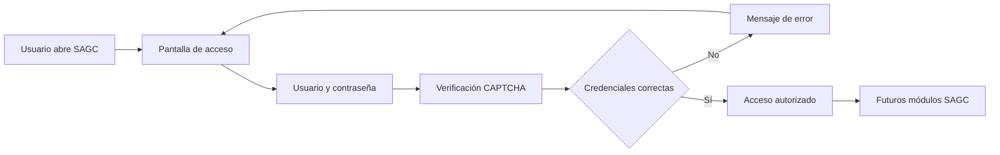
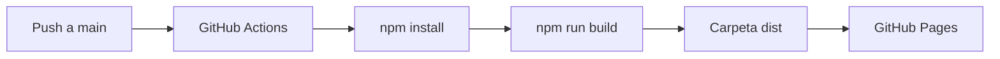
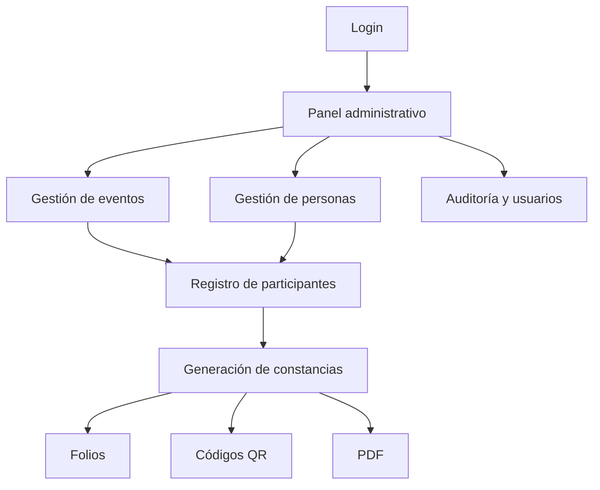

<div align="center">
  

  # SAGC

  ### Sistema Automatizado de Gestión de Constancias

  Interfaz web en React + Vite para el acceso inicial del SAGC, basada en la identidad visual institucional del COCYTIEG y en la estructura de autenticación utilizada por FESGRO.

  <br />

  <a href="https://github.com/gio-canto/Sistema-automatizado-de-gesti-n-de-constancias-SAGC-">
    
  </a>
  <a href="https://gio-canto.github.io/Sistema-automatizado-de-gesti-n-de-constancias-SAGC-/">
    
  </a>
  <a href="https://github.com/gio-canto/Sistema-automatizado-de-gesti-n-de-constancias-SAGC-/actions">
    
  </a>

  <br /><br />

  
  
  
  
  
</div>

---

> [!IMPORTANT]
> **Mantener este repositorio en privado.** El proyecto todavía utiliza una autenticación local de prototipo y contiene referencias directas a la interfaz institucional. No deben agregarse contraseñas reales, tokens, claves privadas, credenciales de servicios ni secretos dentro del código frontend.

## Contenido

- [Descripción](#descripción)
- [Estado actual](#estado-actual)
- [Vista general](#vista-general)
- [Acceso de prueba](#acceso-de-prueba)
- [Requisitos](#requisitos)
- [Instalación completa](#instalación-completa)
- [Ejecutar en desarrollo](#ejecutar-en-desarrollo)
- [Compilar para producción](#compilar-para-producción)
- [Despliegue con GitHub Pages](#despliegue-con-github-pages)
- [Cómo actualizar el proyecto](#cómo-actualizar-el-proyecto)
- [Estructura del repositorio](#estructura-del-repositorio)
- [Cómo funciona el login](#cómo-funciona-el-login)
- [Imágenes del login](#imágenes-del-login)
- [Logo institucional](#logo-institucional)
- [CSS y diseño](#css-y-diseño)
- [Seguridad](#seguridad)
- [Mantener el repositorio privado](#mantener-el-repositorio-privado)
- [Solución de problemas](#solución-de-problemas)
- [Próximas etapas](#próximas-etapas)

---

## Descripción

El **Sistema Automatizado de Gestión de Constancias (SAGC)** es un proyecto web orientado a construir una plataforma para la gestión y futura emisión de constancias.

La versión actual se concentra únicamente en el módulo inicial de autenticación y en establecer una base visual consistente con la identidad institucional.

Actualmente el proyecto utiliza:

| Tecnología | Uso |
|---|---|
| React | Interfaz y estados del login |
| Vite | Servidor de desarrollo y compilación |
| CSS | Diseño responsive y adaptación visual |
| GitHub Actions | Compilación y despliegue automático |
| GitHub Pages | Hospedaje estático del prototipo |

---

## Estado actual

La versión actual incluye:

- Pantalla de inicio de sesión.
- Usuario y contraseña.
- Mostrar u ocultar contraseña.
- CAPTCHA local de prototipo.
- Validación de un único usuario de prueba.
- Pantalla de acceso autorizado.
- Carrusel automático de imágenes.
- Logo horizontal institucional del Consejo.
- Diseño adaptable a escritorio y móvil.
- Compilación con Vite.
- Workflow de GitHub Actions preparado para GitHub Pages.

Todavía **no existe un backend de autenticación real**.

---

## Vista general



### Flujo de despliegue



---

## Acceso de prueba

La autenticación actual es local y solamente sirve para validar el funcionamiento visual del flujo.

```text
Usuario: demo
Contraseña: demo
```

El CAPTCHA debe marcarse antes de iniciar sesión.

> [!WARNING]
> Estas credenciales están definidas en el frontend. No representan un mecanismo de seguridad real y no deben sustituir una autenticación del lado del servidor.

---

## Requisitos

Antes de instalar SAGC se recomienda contar con:

- **Git** instalado.
- **Node.js 20 o superior**.
- **npm**.
- Una cuenta de GitHub con acceso al repositorio privado.
- Editor recomendado: Visual Studio Code.

Comprobar Node.js:

```bash
node --version
```

Comprobar npm:

```bash
npm --version
```

Comprobar Git:

```bash
git --version
```

---

# Instalación completa

## 1. Obtener acceso al repositorio

El repositorio está pensado para mantenerse privado.

Abrir:

**https://github.com/gio-canto/Sistema-automatizado-de-gesti-n-de-constancias-SAGC-**

La cuenta utilizada debe tener permisos sobre el repositorio.

---

## 2. Clonar el proyecto

Desde una terminal:

```bash
git clone https://github.com/gio-canto/Sistema-automatizado-de-gesti-n-de-constancias-SAGC-.git
```

Entrar a la carpeta:

```bash
cd Sistema-automatizado-de-gesti-n-de-constancias-SAGC-
```

---

## 3. Instalar dependencias

```bash
npm install
```

Esto instalará React, React DOM, Vite y los paquetes declarados en `package.json`.

---

## 4. Iniciar el servidor local

```bash
npm run dev
```

Vite mostrará una dirección similar a:

```text
http://localhost:5173/
```

Abrir esa dirección en el navegador.

---

## 5. Iniciar sesión

Usar:

```text
Usuario: demo
Contraseña: demo
```

Después:

1. Escribir el usuario.
2. Escribir la contraseña.
3. Marcar el CAPTCHA.
4. Presionar **Iniciar sesión**.
5. El sistema mostrará la pantalla de acceso autorizado.

---

# Ejecutar en desarrollo

Comando principal:

```bash
npm run dev
```

Para detener el servidor:

```text
Ctrl + C
```

Cada vez que se modifica `App.jsx` o `styles.css`, Vite actualiza la página automáticamente durante el desarrollo.

---

# Compilar para producción

Generar una versión optimizada:

```bash
npm run build
```

Vite creará:

```text
dist/
```

Para probar localmente esa compilación:

```bash
npm run preview
```

---

# Despliegue con GitHub Pages

El repositorio contiene:

```text
.github/workflows/deploy-pages.yml
```

El workflow se ejecuta cuando se hace `push` a `main`.

Proceso automático:

```text
Checkout
   ↓
Node.js 20
   ↓
npm install
   ↓
npm run build
   ↓
Upload dist
   ↓
GitHub Pages
```

### URL prevista

**https://gio-canto.github.io/Sistema-automatizado-de-gesti-n-de-constancias-SAGC-/**

### Ver el estado del despliegue

Abrir:

**https://github.com/gio-canto/Sistema-automatizado-de-gesti-n-de-constancias-SAGC-/actions**

Buscar el workflow:

```text
Deploy Vite site to GitHub Pages
```

> [!NOTE]
> GitHub Pages para repositorios privados depende del plan y de la configuración de la cuenta. Si Pages no está disponible para el repositorio privado, no se debe volver público únicamente para hacer funcionar el prototipo sin antes revisar qué código y recursos quedarían expuestos.

---

# Cómo actualizar el proyecto

## Revisar cambios

```bash
git status
```

## Agregar cambios

```bash
git add .
```

## Crear un commit

```bash
git commit -m "Describe el cambio realizado"
```

Ejemplo:

```bash
git commit -m "Mejorar diseño del login SAGC"
```

## Subir a GitHub

```bash
git push origin main
```

Después del `push`, GitHub Actions intentará desplegar la versión nueva.

---

# Estructura del repositorio

```text
Sistema-automatizado-de-gesti-n-de-constancias-SAGC-/
│
├── .github/
│   └── workflows/
│       └── deploy-pages.yml
│
├── App.jsx
├── index.html
├── main.jsx
├── package.json
├── README.md
├── styles.css
└── vite.config.js
```

### Archivos principales

| Archivo | Función |
|---|---|
| `App.jsx` | Lógica e interfaz del login |
| `styles.css` | Diseño del acceso, imágenes, inputs y responsive |
| `main.jsx` | Punto de entrada de React |
| `index.html` | Documento HTML inicial |
| `vite.config.js` | Configuración de Vite y ruta base para Pages |
| `package.json` | Dependencias y comandos npm |
| `.github/workflows/deploy-pages.yml` | Despliegue automático |

---

# Cómo funciona el login

La versión actual utiliza estados de React para manejar:

```text
user
password
showPassword
captchaChecked
captchaLoading
message
authenticated
```

La validación temporal se realiza en `App.jsx`.

```js
const DEMO_USER = 'demo';
const DEMO_PASSWORD = 'demo';
```

Cuando el proyecto incorpore backend, estas constantes deberán eliminarse y sustituirse por una petición segura al servidor.

Ejemplo futuro:

```text
POST /api/auth/login
```

Nunca se deben guardar contraseñas reales directamente en `App.jsx`.

---

# Imágenes del login

El panel izquierdo utiliza cuatro imágenes almacenadas actualmente en Firebase Storage.

Las direcciones se encuentran en `App.jsx` dentro de:

```js
const LOGIN_IMAGES = [
  'imagen1',
  'imagen2',
  'imagen3',
  'imagen4',
];
```

El carrusel cambia automáticamente cada aproximadamente **6.5 segundos**.

### Ajuste visual utilizado

Para evitar recortes excesivos se emplean dos capas:

1. La fotografía como fondo ampliado y desenfocado.
2. La fotografía principal con `object-fit: contain`.

Esto permite mostrar prácticamente toda la imagen sin dejar un fondo vacío cuando la proporción de la fotografía no coincide con la pantalla.

La configuración principal se encuentra en:

```css
.login-slide::before
```

y:

```css
.imagen-mamalona {
  object-fit: contain;
}
```

---

# Logo institucional

El login utiliza el logo horizontal del Consejo desde:

```text
https://www.fesgro.cocytieg.gob.mx/images/logo_horizontal_w_256.png
```

La constante se encuentra en `App.jsx`:

```js
const OFFICIAL_LOGO = 'https://www.fesgro.cocytieg.gob.mx/images/logo_horizontal_w_256.png';
```

Si en el futuro el sistema dispone de un recurso institucional propio para SAGC, se recomienda almacenarlo dentro del proyecto o en un CDN institucional controlado.

---

# CSS y diseño

El diseño toma como referencia la estructura de autenticación utilizada por FESGRO y conserva clases como:

```text
.auth-container
.back-image
.container-image
.front-form
.resheno
.form-container
.sub-form-container
.logo-inicio
.children-form
.login-form
.input-container
.ant-input-affix-wrapper
.btn-cocytieg
.btn-cocytieg--primario
```

El color principal del botón es:

```css
#1877f2
```

Estados utilizados:

```css
Normal:  #1877f2
Hover:   #3588f4
Active:  #1568d4
```

No se copió el CSS completo de FESGRO porque contiene estilos de módulos que SAGC todavía no utiliza, incluyendo tablas, perfiles, modales, editores y dashboard.

---

# Seguridad

La versión actual es un prototipo frontend.

Antes de utilizar SAGC con usuarios reales deben implementarse como mínimo:

- Backend de autenticación.
- Contraseñas con hash mediante Argon2id o bcrypt.
- HTTPS.
- Sesiones seguras.
- Cookies `HttpOnly` y `Secure`.
- Protección CSRF cuando aplique.
- Rate limiting.
- Bloqueo progresivo de intentos.
- Validación del CAPTCHA en servidor.
- Control de roles y permisos.
- Cierre e invalidación de sesiones.
- Auditoría de accesos administrativos.
- Expiración de sesiones.
- Restablecimiento seguro de contraseña.
- 2FA para cuentas administrativas cuando sea necesario.

### Nunca subir al repositorio

```text
Contraseñas reales
Tokens
API keys privadas
Claves de Firebase administrativas
Credenciales de bases de datos
Llaves privadas
Archivos .env con secretos
Certificados privados
```

Para datos sensibles deben utilizarse variables de entorno y, en GitHub, **Actions Secrets** cuando corresponda.

---

# Mantener el repositorio privado

Este proyecto debe permanecer privado mientras contenga código interno o recursos institucionales que no estén destinados a publicación pública.

### Comprobar privacidad en GitHub

1. Abrir el repositorio.
2. Entrar a **Settings**.
3. Abrir **General**.
4. Bajar hasta **Danger Zone**.
5. Revisar **Change repository visibility**.
6. Confirmar que el repositorio está configurado como **Private**.

### Antes de cambiarlo a público

Revisar como mínimo:

- Historial de commits.
- Archivos eliminados anteriormente.
- Credenciales antiguas.
- Tokens.
- Configuración de servicios externos.
- Recursos institucionales.
- Licencias y permisos de imágenes.
- Datos personales.

> [!CAUTION]
> Eliminar un secreto en el último commit no necesariamente lo elimina del historial de Git. Si alguna credencial real se publica accidentalmente, debe revocarse inmediatamente y después limpiarse el historial cuando corresponda.

---

# Solución de problemas

## `npm` no se reconoce

Instalar Node.js y volver a abrir la terminal.

Comprobar:

```bash
node --version
npm --version
```

---

## La página aparece en blanco

Comprobar que `index.html` apunte a:

```html
<script type="module" src="/main.jsx"></script>
```

También revisar la consola del navegador.

---

## Las dependencias fallan

Eliminar `node_modules` y reinstalar.

En macOS/Linux:

```bash
rm -rf node_modules
npm install
```

En Windows PowerShell:

```powershell
Remove-Item -Recurse -Force node_modules
npm install
```

---

## GitHub Pages carga sin estilos

Revisar `vite.config.js`.

Debe conservar la ruta base del repositorio:

```js
base: '/Sistema-automatizado-de-gesti-n-de-constancias-SAGC-/'
```

---

## Las imágenes no cargan

Las fotografías se solicitan desde Firebase Storage. Revisar:

1. Conexión a internet.
2. Consola del navegador.
3. Que las URLs continúen disponibles.
4. Políticas CORS del servidor de imágenes.

---

## El logo no carga

El logo se obtiene actualmente desde el dominio de FESGRO.

Revisar que siga disponible:

```text
https://www.fesgro.cocytieg.gob.mx/images/logo_horizontal_w_256.png
```

---

## El workflow falla

Abrir:

**Repository → Actions → Deploy Vite site to GitHub Pages**

Revisar en qué paso se produjo el error:

```text
Checkout
Setup Node
Install dependencies
Build
Setup Pages
Upload artifact
Deploy
```

---

# Próximas etapas

La evolución prevista del SAGC puede incorporar gradualmente:



Posibles etapas:

1. Backend y autenticación real.
2. Roles administrativos.
3. Gestión de eventos.
4. Base de datos de participantes.
5. Carga manual y masiva.
6. Generación de folios.
7. Generación de constancias PDF.
8. Código QR de validación.
9. Consulta pública de constancias.
10. Auditoría y registro de acciones.

---

<div align="center">

### Sistema Automatizado de Gestión de Constancias

**SAGC**

Repositorio de desarrollo interno.

<a href="https://github.com/gio-canto/Sistema-automatizado-de-gesti-n-de-constancias-SAGC-">
  
</a>

</div>
